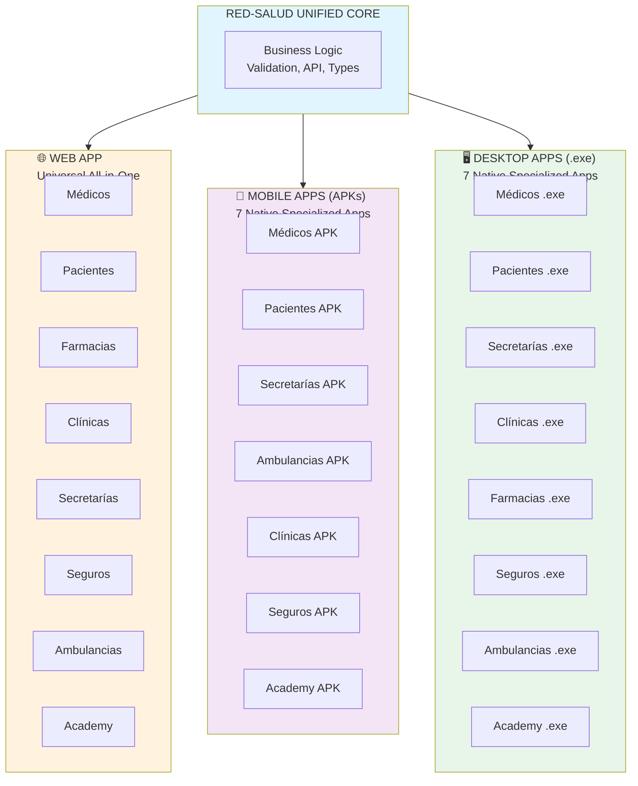
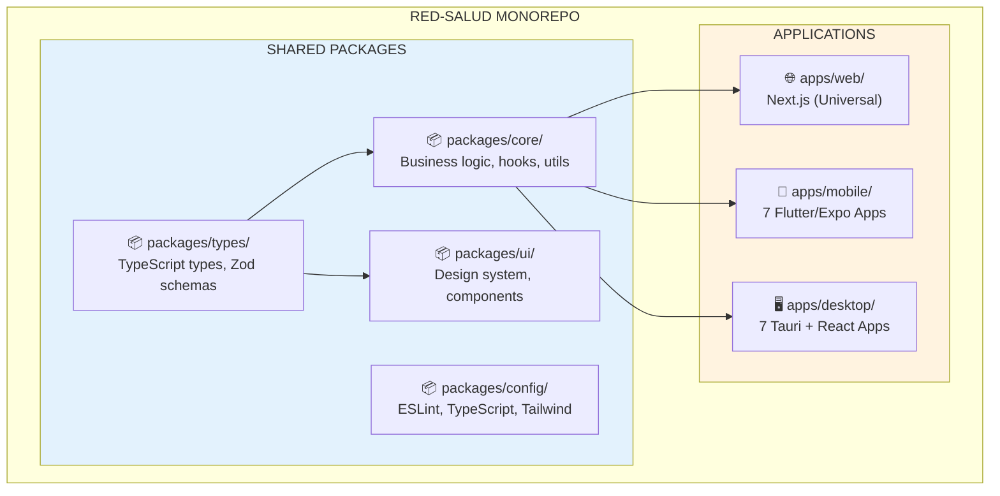

# Red-Salud: Ecosistema Integral de Salud Digital
## "Potencia Adaptable" - Being Everything for Everyone

---

## 🎯 Executive Summary

### The Vision
Red-Salud es **la plataforma de salud definitiva en Latinoamérica**, un ecosistema integrado de **15 aplicaciones especializadas** (1 Web + 7 Mobile + 7 Desktop) diseñadas para ser la solución de software completa para cada rol en el sector salud.

### Our Core Philosophy
**"Potencia Adaptable" (Adaptable Power)**: No construimos herramientas genéricas—construimos soluciones especializadas y completas que se adaptan desde la simplicidad minimalista hasta el poder empresarial para cada rol específico.

### The Scale
- **8 Roles**: Médicos, Pacientes, Farmacias, Clínicas, Secretarías, Seguros, Ambulancias, Academy
- **3 Platforms**: Web (universal), Mobile (APKs nativas), Desktop (.exe nativos)
- **15 Specialized Apps**: Cada rol tiene su experiencia dedicada en mobile y desktop
- **1 Unified Core**: 90% de código compartido a través de arquitectura inteligente de monorepo
- **1 Company**: Todas las apps construidas, conectadas y optimizadas por el mismo equipo

### The Promise
Para un **médico**, no somos solo una app—somos su sistema completo de gestión de práctica, departamento de facturación, equipo de marketing y plataforma de compromiso con pacientes, todo en uno.

Para una **farmacia**, somos su sistema completo de inventario, POS, integración con seguros y red de proveedores.

Somos el **único software** que cada rol necesita.

---

## 🌐 The Complete Ecosystem

### Visual Overview


### Platform Matrix

| Platform | Purpose | Target Use Case | Key Features |
|----------|---------|-----------------|--------------|
| **🌐 Web** | Acceso universal | Tareas rápidas, onboarding, primeros usuarios | Full feature set, browser-based, acceso instantáneo |
| **📱 Mobile** | Productividad móvil | Trabajo de campo, consultas rápidas, notificaciones | Performance nativa, modo offline, cámara, push notifications |
| **🖥️ Desktop** | Workflows de power users | Entrada intensiva de datos, operaciones complejas, multi-tasking | Offline-first, múltiples ventanas, shortcuts de teclado, BD local |

### Connection Model: User Journey Example
**Flujo: Doctor tratando a un paciente**

1. 📱 **[Mobile]** Paciente agenda cita → Notificación push al teléfono del doctor
2. 🖥️ **[Desktop]** Doctor accede al historial del paciente en la clínica (offline si es necesario)
3. 🌐 **[Web]** Paciente ve notas de consulta y prescripción online
4. 📱 **[Mobile]** Farmacia escanea código QR de la receta, dispensa medicamento
5. 🌐 **[Web]** Seguro procesa reclamación automáticamente
6. 🖥️ **[Desktop]** Clínica genera reportes mensuales y facturación

**Resultado**: Experiencia fluida y coordinada a través de todas las plataformas.

---

## 💎 Core Philosophy: "Potencia Adaptable"

### The Principle
**Ser "todo" para cada rol específico.**

No un "jack-of-all-trades"—sino un **maestro de cada oficio** a través de experiencias especializadas y adaptadas a cada rol.

### Adaptive Complexity Model

```
┌─────────────────────────────────────────────────────────────┐
│                 USER COMPLEXITY SPECTRUM                    │
│              (ESPECTRO DE COMPLEJIDAD DEL USUARIO)           │
└─────────────────────────────────────────────────────────────┘

Simple User                  Power User                  Enterprise
     │                           │                            │
     ↓                           ↓                            ↓
┌─────────┐              ┌─────────────┐             ┌──────────────┐
│ MINIMAL │              │  STANDARD   │             │   ADVANCED   │
│ MODE    │              │    MODE     │             │     MODE     │
├─────────┤              ├─────────────┤             ├──────────────┤
│• Clean  │              │• All core   │             │• Full metrics│
│  UI     │              │  features   │             │• Advanced KPIs│
│• Only   │              │• Basic      │             │• Inventory   │
│  essentials│            │  reporting  │             │• Multi-user  │
│• Zero   │              │• Standard   │             │• API access  │
│  setup  │              │  workflows │             │• Custom rules│
└─────────┘              └─────────────┘             └──────────────┘

Activación: Usuario activa/desactiva módulos en configuración
Ejemplo: "Activar: Módulo de Facturación Avanzada" → UI se transforma
```

### Real-World Examples

#### Example 1: Solo Doctor (Modo Minimalista)
- **Interface**: Calendario limpio, lista de pacientes, notas básicas
- **Workflow**: Abrir app → Ver citas de hoy → Click en paciente → Escribir nota → Listo
- **Módulos Activos**: Citas, Registros Básicos
- **Módulos Ocultos**: Facturación, Marketing, Analytics Avanzados, Gestión de Staff

#### Example 2: Growing Practice (Modo Standard)
- **Interface**: Dashboard con métricas clave, gestión de citas, recordatorios de pacientes
- **Workflow**: Confirmaciones automáticas, facturación básica, integración de telemedicina
- **Módulos Activos**: Todos los Minimal + Facturación, Telemedicina, Recordatorios, Reportes Básicos
- **Módulos Ocultos**: Analytics Avanzados, Multi-location Management, Workflows Personalizados

#### Example 3: Medical Enterprise (Modo Advanced)
- **Interface**: Centro de comando con métricas en vivo, KPIs, performance de staff, optimización de revenue
- **Workflow**: RCM automatizado, tracking de inventario, coordinación multi-clínica, reportes avanzados
- **Módulos Activos**: Todo + Suite RCM, Inventario, Multi-location, APIs Personalizadas, White-label
- **Capabilities**: Funcionalidad de nivel ERP completo para healthcare

### Modular Activation System
```typescript
// Conceptual Module Structure
const modules = {
  core: {
    appointments: { active: true, required: true },
    patients: { active: true, required: true },
    consultations: { active: true, required: true }
  },
  business: {
    billing: { active: false },        // User choice
    inventory: { active: false },      // User choice
    insurance: { active: false },      // User choice
    marketing: { active: false }       // User choice
  },
  advanced: {
    analytics: { active: false },      // Requires: billing
    rcm: { active: false },            // Requires: billing + insurance
    multi_location: { active: false }, // Requires: staff management
    api_access: { active: false }      // Enterprise only
  }
}

// La UI se adapta dinámicamente según los módulos activos
```

---

## 👥 Role-Specific Vision: "The Complete Software"

### 1. 👨‍⚕️ Médicos (Doctors)
**"From Solo Practice to Medical Empire"**
**"Desde Consulta Solitaria a Imperio Médico"**

#### Who They Are
- Practitioners independientes, empleados de clínicas, emprendedores médicos
- Desde médicos solitarios hasta dueños de multi-clínicas
- Prioridad: Eficiencia, cuidado del paciente, crecimiento de la práctica

#### Their Complete Software
- **📅 Smart Scheduling**: Citas optimizadas con IA, detección de conflictos, recordatorios automáticos
- **👨‍⚕️ Practice Management**: Registros de pacientes, notas de consulta, prescripción de medicamentos
- **💰 RCM Suite**: Facturación, reclamos de seguros, tracking de pagos, analytics de revenue
- **📊 Telemedicine**: Videollamadas integradas, consultas remotas, prescripciones digitales
- **📈 Growth Tools**: Retención de pacientes, gestión de reviews, tracking de referidos
- **🏥 Multi-Location**: Gestión de múltiples clínicas, coordinación de staff, registros centralizados
- **📱 Mobile Freedom**: Ver citas en el teléfono, llamar pacientes, notas rápidas

#### The Promise
> "Red-Salud es el único software que un médico necesita para gestionar toda su práctica médica—desde la primera cita con el paciente hasta el pago final del seguro."

---

### 2. 👤 Pacientes (Patients)
**"Your Health, Your Control"**
**"Tu Salud, Tu Control"**

#### Who They Are
- Individuos conscientes de su salud, pacientes con enfermedades crónicas, cuidadores
- Necesitan: Acceso, claridad, control sobre su journey de salud

#### Their Complete Software
- **📅 Easy Booking**: Encontrar doctores, agendar citas, confirmaciones instantáneas
- **📋 Medical Records**: Historial completo, resultados de laboratorio, prescripciones, todo en un solo lugar
- **💊 Medication Management**: Recordatorios, solicitudes de refill, alertas de interacciones
- **📥 Telemedicine**: Video consultas desde casa, chat con doctores
- **📊 Health Tracking**: Síntomas, signos vitales, gráficos de progreso, compartir con doctores
- **🔔 Smart Reminders**: Citas, medicamentos, cuidados preventivos
- **🏥 Insurance Integration**: Ver cobertura, enviar reclamos, tracking de aprobaciones

#### The Promise
> "Red-Salud pone a los pacientes en control de su journey de salud—toda cita, todo resultado, todo medicamento, siempre accesible."

---

### 3. 💊 Farmacias (Pharmacies)
**"From Corner Store to Logistics Hub"**
**"De Tienda de Esquina a Hub Logístico"**

#### Who They Are
- Farmacias independientes, cadenas de farmacias, farmacias hospitalarias
- Necesitan: Precisión de inventario, velocidad, integración con seguros

#### Their Complete Software
- **📦 Inventory Management**: Tracking de stock en tiempo real, alertas de expiración, reordenamiento automático
- **🛒 Point of Sale (POS)**: Checkout rápido, scanning de códigos de barras, integración de pagos
- **💊 Prescription Processing**: Integración de recetas digitales, validación de seguros, tracking de dispensación
- **📊 Sales Analytics**: Best-sellers, márgenes de profit, insights de clientes
- **🚚 Delivery System**: Routing de órdenes, tracking de conductores, notificaciones a clientes
- **🔔 Supplier Network**: Ordenamiento directo, compras al por mayor, comparación de precios
- **⚠️ Alerts System**: Retiros del mercado, escasez, advertencias de expiración, interacciones de medicamentos

#### The Promise
> "Red-Salud transforma farmacias en hubs logísticos modernos—gestionando inventario, procesando recetas y sirviendo pacientes con precisión y velocidad."

---

### 4. 🏥 Clínicas (Clinics)
**"Orchestrate Your Healthcare Empire"**
**"Orquesta tu Imperio de Salud"**

#### Who They Are
- Clínicas privadas, centros de diagnóstico, hospitales multi-especialidad
- Necesitan: Coordinación, optimización de recursos, facturación compleja

#### Their Complete Software
- **👥 Resource Management**: Scheduling de habitaciones, booking de equipos, asignación de staff
- **📊 Multi-Department Coordination**: Lab, radiología, farmacia, consultas—integrado
- **💳 Complex Billing**: Facturas multi-servicio, paquetes de seguros, planes de pago
- **📈 Analytics Dashboard**: Flujo de pacientes, revenue por departamento, performance de staff
- **🔐 Role-Based Access**: Doctores, enfermeras, admin, especialistas—permisos personalizados
- **🏥 Bed Management**: Admisiones, altas, transferencias, tracking de ocupación
- **📱 Mobile Staff Access**: Enfermeras actualizan registros, doctores ven labs en tablets

#### The Promise
> "Red-Salud es el sistema operativo para clínicas modernas—coordinando cada departamento, cada recurso, cada journey de paciente."

---

### 5. 👩‍💼 Secretarías (Secretaries/Admin Staff)
**"The Command Center for Healthcare"**
**"El Centro de Comando de la Salud"**

#### Who They Are
- Secretarias médicas, administradores de clínicas, recepcionistas hospitalarios
- Necesitan: Velocidad, organización, coordinación multi-doctor

#### Their Complete Software
- **📅 Multi-Doctor Calendar**: Gestionar agendas de 5+ doctores, resolución de conflictos
- **📞 Patient Communication**: Llamadas, mensajes, confirmaciones de citas
- **📝 Digital Intake**: Registro de pacientes, verificación de seguros, completado de formularios
- **🔔 Task Management**: Follow-ups, solicitudes de documentos, coordinación de referidos
- **📊 Front Desk Analytics**: No-shows, patrones de booking, satisfacción de pacientes
- **🔄 Workflow Automation**: Recordatorios, solicitudes de documentación, preparación de facturación
- **👥 Patient Database**: Registros completos, búsqueda rápida, favoritos, tags

#### The Promise
> "Red-Salud da a las secretarias superpoderes—gestionando múltiples doctores, cientos de pacientes y workflows complejos con elegancia y eficiencia."

---

### 6. 🛡️ Seguros (Insurance Companies)
**"Intelligent Claims, Happy Members"**
**"Reclamos Inteligentes, Miembros Felices"**

#### Who They Are
- Proveedores de seguros de salud, empresas de medicina prepagada
- Necesitan: Procesamiento de reclamos, detección de fraude, gestión de costos

#### Their Complete Software
- **📋 Claims Processing**: Sumisiones digitales, reglas de auto-aprobación, pagos rápidos
- **🔍 Fraud Detection**: Análisis de patrones con IA, sistema de alertas
- **👥 Member Management**: Inscripción, tiers de cobertura, tracking de beneficiarios
- **📊 Provider Network**: Directorios de clínica/farmacia, credenciales, tracking de performance
- **💰 Cost Analytics**: Tendencias de reclamos, eficiencia de proveedores, insights de reducción de costos
- **🤝 Integration Hub**: Conectar con clínicas, hospitales, labs para datos en tiempo real
- **📱 Member App**: Miembros ven cobertura, envían reclamos, tracking de aprobaciones

#### The Promise
> "Red-Salud moderniza operaciones de seguros—acelerando reclamos, detectando fraude y deleitando a miembros con transparencia y velocidad."

---

### 7. 🚑 Ambulancias (Ambulance Services)
**"Emergency Response, Perfected"**
**"Respuesta de Emergencia, Perfeccionada"**

#### Who They Are
- Servicios de ambulancia privados, flotas hospitalarias, respondedores de emergencia
- Necesitan: Velocidad, coordinación, tracking en tiempo real

#### Their Complete Software
- **🚨 Dispatch System**: Solicitudes de emergencia, tracking GPS, asignación de unidad más cercana
- **📍 Real-Time Tracking**: Ubicación en vivo de vehículos, cálculo de ETA, optimización de rutas
- **📋 Patient Intake**: Formularios rápidos, entrada de signos vitales, reporte de incidentes
- **🏥 Hospital Handoff**: Reportes digitales, notificaciones de instalaciones, disponibilidad de camas
- **💰 Billing Integration**: Captura de servicios, reclamos de seguros, generación de facturas
- **📊 Fleet Management**: Mantenimiento de vehículos, scheduling de tripulación, analytics de tiempo de respuesta
- **📱 Mobile Crew App**: Paramédicos actualizan estado, ven navegación, acceden a protocolos

#### The Promise
> "Red-Salud potencia servicios de emergencia—coordinando dispatch, tracking flotas y asegurando handoffs seamless a hospitales."

---

### 8. 🎓 Academy (Education Platform)
**"Continuous Medical Learning, Integrated"**
**"Aprendizaje Médico Continuo, Integrado"**

#### Who They Are
- Estudiantes de medicina, doctores en práctica buscando especialización, profesionales de salud
- Necesitan: Contenido de calidad, certificaciones, avance profesional

#### Their Complete Software
- **📚 Course Library**: Tracks especializados (cardiología, pediatría, cirugía, etc.)
- **🎥 Video Lessons**: Contenido liderado por expertos, estudios de caso, demostraciones de procedimientos
- **📝 Interactive Quizzes**: Checks de conocimiento, preparación de exámenes, feedback instantáneo
- **🏆 Certifications**: Ganar credenciales, compartir en profiles profesionales
- **📊 Progress Tracking**: Learning paths, tasas de finalización, gaps de habilidades
- **👥 Community**: Foros de discusión, Q&A con expertos, networking de pares
- **🔗 Professional Integration**: Cursos vinculados a práctica del mundo real, recomendaciones de IA

#### The Promise
> "Red-Salud Academy no es solo aprendizaje—es crecimiento profesional integrado en la práctica diaria, preparando profesionales de salud para el futuro de la medicina."

---

## 📱 Platform Strategy: When to Use What

### Web Application
**Use when:**
- Tareas rápidas, únicas (ver cita, revisar resultado de lab)
- Onboarding de primeros usuarios
- Setup administrativo (creación de cuenta, configuración)
- Usuarios sin apps nativas (pacientes accediendo desde computadoras del trabajo)
- Preview antes de descargar mobile/desktop

**Strengths:**
- ✅ Zero instalación
- ✅ Actualizaciones instantáneas
- ✅ Acceso universal
- ✅ Páginas públicas SEO-friendly

**Limitations:**
- ❌ Dependencia del browser
- ❌ Requiere internet
- ❌ Menos optimizado para tareas repetitivas

---

### Mobile Applications (APKs)
**Use when:**
- Acceso on-the-go (doctores entre clínicas, pacientes viajando)
- Interacciones rápidas (aprobar cita, enviar mensaje)
- Integración de cámara (escanear documentos, recetas QR)
- Push notifications (recordatorios de citas, alertas urgentes)
- Workflows críticos offline (ambulancias con pobre conectividad)

**Strengths:**
- ✅ Performance nativa
- ✅ Integración de hardware (cámara, GPS, biometría)
- ✅ Arquitectura offline-first
- ✅ Sistema de push notifications

**Platform-Specific Optimizations:**
- **👨‍⚕️ Médicos App**: Búsqueda rápida de pacientes, llamadas con un toque, dictado por voz para notas
- **👤 Pacientes App**: Booking de citas, telemedicina, recordatorios de medicamentos
- **👩‍💼 Secretarías App**: Calendario multi-doctor, llamadas a pacientes, messaging rápido
- **🚑 Ambulancias App**: Tracking GPS, dispatch de emergencia, formularios offline

---

### Desktop Applications (.exe)
**Use when:**
- Entrada intensiva de datos (registros médicos, facturación, inventario)
- Workflows complejos (multi-ventana, drag-and-drop)
- Sesiones de trabajo largas (recepción de clínica, mostrador de farmacia)
- Requisito offline-first (clínicas rurales, internet pobre)
- Setups multi-monitor (doctor viendo historial + escribiendo prescripción)

**Strengths:**
- ✅ Verdadera capacidad offline (BD local SQLite)
- ✅ Shortcuts de teclado y features de power-user
- ✅ Workflows multi-ventana
- ✅ Acceso al sistema de archivos (exportar reportes, importar data masiva)
- ✅ Integración de impresión (prescripciones, etiquetas, facturas)

**Platform-Specific Optimizations:**
- **👨‍⚕️ Médicos Desktop**: Suite EMR completa, dashboard RCM, workstation de analytics
- **🏥 Clínicas Desktop**: Coordinación multi-departamento, gestión de camas, facturación compleja
- **💊 Farmacias Desktop**: Sistema POS, gestor de inventario, ordenamiento a proveedores
- **👩‍💼 Secretarías Desktop**: Centro de comando multi-doctor, operaciones batch, reportes

---

## 🏗 Technical Foundation: Monorepo Architecture

### The "Core Shared" Strategy


### Code Sharing Statistics
- **90%** de lógica de negocio compartida entre plataformas (validaciones, API calls, transformaciones de datos)
- **80%** de componentes UI compartidos (web y desktop usan componentes React, mobile usa equivalentes Flutter)
- **100%** de tipos compartidos (single source of truth para estructuras de datos)
- **95%** de backend API compartido (todas las apps consumen el mismo backend Supabase)

### The "Write Once, Deploy Everywhere" Promise
```typescript
// Example: Patient validation logic
// Location: packages/core/src/validations/patient.ts

import { z } from 'zod'

export const patientSchema = z.object({
  first_name: z.string().min(2, 'Mínimo 2 caracteres'),
  last_name: z.string().min(2, 'Mínimo 2 caracteres'),
  email: z.string().email('Email inválido'),
  phone: z.string().regex(/^[0-9]{10,15}$/, 'Teléfono inválido'),
  date_of_birth: z.coerce.date(),
  blood_type: z.enum(['A+', 'A-', 'B+', 'B-', 'AB+', 'AB-', 'O+', 'O-']).optional(),
  // ... 50+ more fields
})

export type Patient = z.infer<typeof patientSchema>

// This SAME validation runs on:
// ✅ Web (apps/web)        → Browser
// ✅ Desktop (Tauri apps)  → Windows/Mac/Linux
// ✅ Mobile (Flutter)      → Converted via platform bridge
// ✅ Backend (Edge functions) → Supabase
```

### Specialized Shells Pattern
Cada app es una "cáscara delgada" que importa paquetes compartidos:

```typescript
// apps/web/app/dashboard/medico/page.tsx
import { AppointmentForm } from '@red-salud/ui'  // Shared component
import { useAppointments } from '@red-salud/core' // Shared hook
import { Appointment } from '@red-salud/types'   // Shared type

// The page just COMPOSES shared pieces
export default function MedicoDashboard() {
  const { appointments, loading } = useAppointments()
  return (
    <div>
      <h1>Dashboard Médico</h1>
      <AppointmentForm appointments={appointments} />
    </div>
  )
}
```

La misma lógica aplica a equivalentes desktop (Tauri) y mobile (Flutter)—solo diferente cáscara, mismo core.

---

## 🚀 Differentiators: Why Red-Salud Wins

### 1. Specialized vs Generic
| Competidores | Red-Salud |
|-------------|-----------|
| Una web app para todos | 15 apps especializadas, cada una optimizada para su rol |
| Software médico genérico | Workflows específicos por rol (ej: dispatch de ambulancias) |
| UI one-size-fits-all | Complejidad adaptativa (minimal → enterprise) |
| Dependiente del browser | Apps móviles + desktop nativas para power users |

### 2. Integrated vs Fragmented
| Competidores | Red-Salud |
|-------------|-----------|
| Doctor usa App A, paciente usa App B | Todas las apps conectadas en un ecosistema |
| Transferencia manual de datos entre sistemas | Sync en tiempo real entre todas las apps |
| Logins separados para cada servicio | Single sign-on, experiencia unificada |
| Productos competidores con prioridades conflictivas | Una empresa, una visión, UX seamless |

### 3. Complete vs Piecemeal
| Competidores | Red-Salud |
|-------------|-----------|
| Comprar software de scheduling ($50/mes) | Scheduling incluido |
| Comprar software de facturación ($100/mes) | Facturación incluida |
| Comprar plataforma de telemedicina ($80/mes) | Telemedicina incluida |
| Comprar tool de analytics ($60/mes) | Analytics incluido |
| **Total: $290+/mes** | **Todo incluido, mejor valor** |

### 4. Innovation-First
- **🤖 AI-Powered**: Optimización de citas, sugerencias de diagnóstico, detección de fraude
- **📴 Offline-First**: Desktop apps funcionan sin internet (clínicas rurales, emergencias)
- **⚡ Real-Time Sync**: Cambios en mobile se reflejan instantáneamente en desktop
- **🔗 Hardware Integration**: Códigos QR, auth biométrico, tracking GPS, scanning de cámara
- **🚀 Modern Stack**: TypeScript, React, Flutter, Tauri, Supabase—future-proof

### 5. Latin America Focus
- **🌎 Localized**: Español/Portugués first, no traducción de pensamiento posterior
- **🏥 Regional Features**: Validación de Cédula, integraciones de seguros locales, métodos de pago regionales
- **🌐 Infrastructure Awareness**: Diseñado para internet inestable, dispositivos older, usuarios cost-conscious
- **👥 Community**: Construido por desarrolladores LATAM, para healthcare LATAM

---

## 🗺 Future Roadmap

### Phase 1: Foundation (Current - Q2 2025)
✅ Estructura de monorepo core
✅ Web app con todos los dashboards de 8 roles
✅ Desktop apps (Tauri) para 3 roles (Médicos, Clínicas, Secretarías)
✅ Mobile apps (Flutter) para 2 roles (Médicos, Pacientes)
✅ Paquetes compartidos (core, types, ui)

### Phase 2: Specialization (Q3 2025)
🔄 Completar desktop apps restantes (Farmacia, Seguro, Ambulancia, Academy)
🔄 Completar mobile apps restantes (Secretaría, Ambulancia, Clínica, Seguro, Academy)
🔄 Módulos avanzados por rol (RCM para doctores, tracking de flotas para ambulancias)
🔄 Motor de sync offline-first para todas las desktop apps

### Phase 3: Intelligence (Q4 2025 - Q1 2026)
🔮 Scheduling con IA (booking predictivo)
🔮 Sugerencias de diagnóstico (integración ICD-11)
🔮 Detección de fraude en seguros (anomaly detection)
🔮 Predicción de inventario (farmacias)
🔮 Predicción de no-show de pacientes

### Phase 4: Academy Evolution (Q2 2026+)
🎓 Simulaciones quirúrgicas interactivas (VR/AR)
🎓 Tutor AI para estudiantes de medicina
🎓 Biblioteca de estudios de caso del mundo real (anonymized)
🎓 Integración de certificaciones con profiles profesionales
🎓 Workshops y webinars live

### Phase 5: Ecosystem Expansion (2026+)
🌍 Expansión regional (Brasil, Colombia, México)
🌍 Integración de devices IoT (wearables, smart scales)
🌍 Hospital ERP (gestión hospitalaria full-scale)
🌍 Research platform (clinical trials, anonymización de data)
🌍 Telehealth API (integrar con clínicas terceras)

---

## 📈 Success Metrics

### User Adoption
- **10,000+ doctores activos** para finales de 2025
- **100,000+ pacientes activos** para finales de 2025
- **1,000+ clínicas** usando desktop apps para finales de 2026
- **500+ farmacias** completamente integradas para finales de 2026

### Engagement
- **70%+ usuarios diarios activos** entre doctores
- **50%+ de citas booked via mobile** por pacientes
- **80%+ reducción en no-shows** con recordatorios inteligentes
- **30%+ aumento en revenue de práctica** para doctores usando RCM

### Ecosystem Health
- **95%+ uptime** en todas las plataformas
- **<2 segundos de load times** para web app
- **<500ms de sync times** entre apps
- **4.8+ estrellas de rating** en app stores

### Business Impact
- **$1M+ ARR** para finales de 2025
- **$10M+ ARR** para finales de 2026
- **Expansión a 5+ países** para 2027
- **Series A funding readiness** para 2027

---

## 🎯 The Ultimate Vision

### What We're Building
Red-Salud no es solo una suite de apps—es la **infraestructura digital para el healthcare en Latinoamérica**.

### Where We're Going
Desde gestionar citas hasta gestionar journeys de salud. Desde doctores individuales hasta redes hospitalarias. Desde jugadores locales hasta líder regional.

### The End Game
Cuando un profesional de salud en Latinoamérica piensa "software," piensa **Red-Salud**.

Cuando un paciente quiere booked un doctor, revisar un resultado de lab, o refill una prescripción, abre **Red-Salud**.

Cuando una clínica, farmacia, o compañía de seguros necesita modernizar sus operaciones, elige **Red-Salud**.

Porque no estamos construyendo solo software. Estamos construyendo **el futuro del healthcare en Latinoamérica**.

---

## 📚 Supporting Documents

- **[ARCHITECTURE.md](./ARCHITECTURE.md)** - Deep-dive técnico
- **[FEATURES.md](./FEATURES.md)** - Breakdown de features por rol
- **[ROADMAP.md](./ROADMAP.md)** - Timeline detallada de implementación
- **[API.md](./API.md)** - Documentación del Backend API

---

**Last Updated**: January 2026
**Version**: 3.0 - "Potencia Adaptable" Complete Ecosystem Edition
**Status**: Active Development - Phase 1 (Foundation) → Transitioning to Phase 2 (Specialization)
