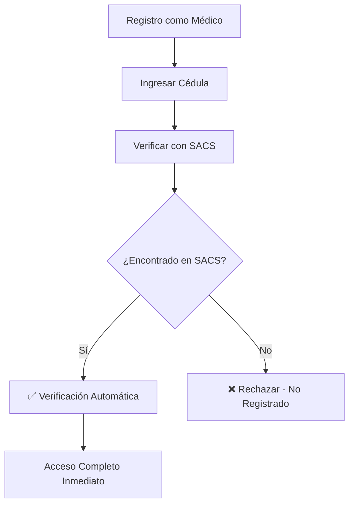
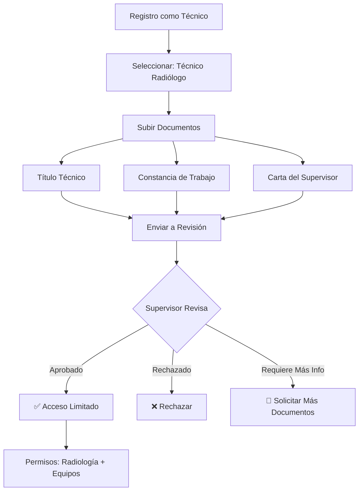
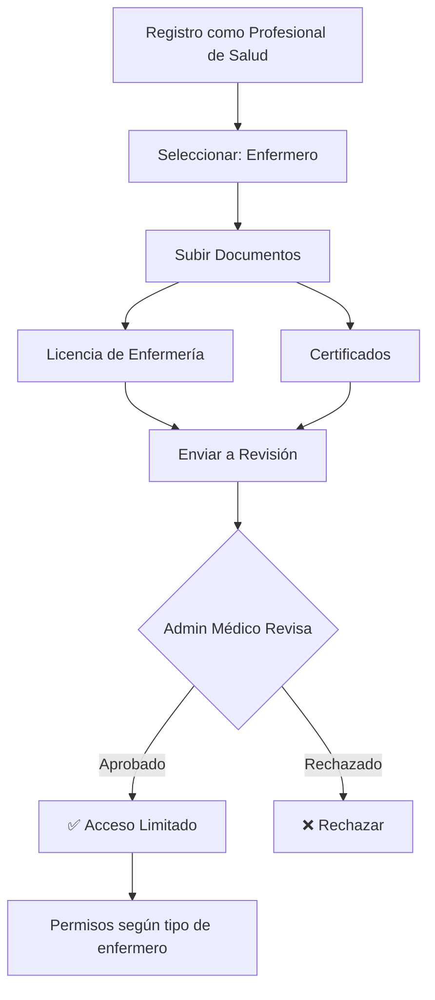
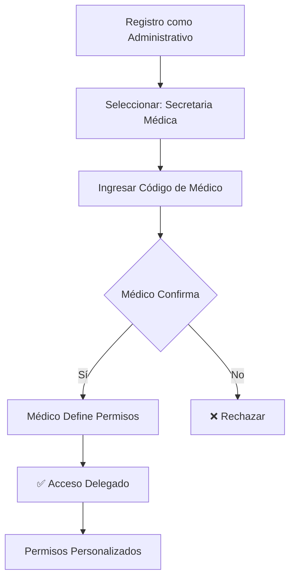

# 🏥 Sistema de Roles y Verificación Multi-Nivel
## Red-Salud - Role-Based Access Control (RBAC)

---

## 📊 Situación Actual

### Roles Existentes
```typescript
// Roles principales del sistema
type UserRole = 
  | 'paciente'     // ❌ Sin verificación especial
  | 'medico'       // ✅ REQUIERE SACS
  | 'secretaria'   // ❌ Sin verificación especial
  | 'farmacia'     // ❌ Sin verificación especial
  | 'admin'        // ✅ Acceso total
  | 'clinica'      // 🚧 Pendiente
  | 'laboratorio'  // 🚧 Pendiente
  | 'ambulancia'   // 🚧 Pendiente
  | 'seguro';      // 🚧 Pendiente
```

### Problema Identificado

**SACS solo valida médicos**, pero hay **MUCHOS otros roles** en el ecosistema de salud que necesitan acceso:

#### ❌ Roles NO cubiertos por SACS:
1. **Técnicos Radiológicos** - Operan equipos de rayos X, TAC, resonancia
2. **Técnicos de Laboratorio** - Procesan muestras, realizan análisis
3. **Enfermeros/Enfermeras** - Cuidados, medicación, asistencia
4. **Asistentes Médicos** - Apoyo en consultas y procedimientos
5. **Personal Administrativo** - Secretarias médicas, recepcionistas
6. **Nutricionistas** - Planes alimenticios, consultas nutricionales
7. **Psicólogos** - Terapia, evaluaciones psicológicas
8. **Fisioterapeutas** - Rehabilitación física
9. **Terapeutas** - Ocupacionales, respiratorios, etc.
10. **Paramédicos** - Personal de ambulancias

---

## 🎯 Solución Propuesta

### Sistema de Verificación Multi-Nivel

```
┌─────────────────────────────────────────────────────────┐
│          NIVELES DE VERIFICACIÓN Y ACCESO               │
├─────────────────────────────────────────────────────────┤
│                                                          │
│  NIVEL 1: Médicos                                       │
│  ✅ Verificación OBLIGATORIA con SACS                    │
│  ✅ Acceso COMPLETO a funciones clínicas                │
│  ✅ Puede recetar, diagnosticar, operar                 │
│                                                          │
│  NIVEL 2: Profesionales de Salud con Registro          │
│  ⚠️  Verificación MANUAL + Documentación                 │
│  ✅ Acceso LIMITADO según especialidad                   │
│  ✅ Puede asistir, reportar, colaborar                  │
│                                                          │
│  NIVEL 3: Personal Técnico                              │
│  ⚠️  Verificación por SUPERVISOR + Certificados         │
│  ⚡ Acceso OPERATIVO específico                          │
│  ✅ Puede operar equipos, procesar muestras             │
│                                                          │
│  NIVEL 4: Personal Administrativo                       │
│  ⚠️  Verificación por MÉDICO RESPONSABLE                 │
│  📋 Acceso ADMINISTRATIVO delegado                       │
│  ✅ Puede agendar, registrar, gestionar documentos      │
│                                                          │
└─────────────────────────────────────────────────────────┘
```

---

## 🏗️ Arquitectura de Roles Propuesta

### 1. Nuevo Sistema de Roles

```typescript
// Rol principal
export enum MainRole {
  PACIENTE = 'paciente',
  MEDICO = 'medico',
  PROFESIONAL_SALUD = 'profesional_salud',
  TECNICO = 'tecnico',
  ADMINISTRATIVO = 'administrativo',
  FARMACIA = 'farmacia',
  CLINICA = 'clinica',
  ADMIN = 'admin',
}

// Sub-roles para profesionales de salud
export enum ProfesionalSaludType {
  ENFERMERO = 'enfermero',
  NUTRICIONISTA = 'nutricionista',
  PSICOLOGO = 'psicologo',
  FISIOTERAPEUTA = 'fisioterapeuta',
  TERAPEUTA_OCUPACIONAL = 'terapeuta_ocupacional',
  TERAPEUTA_RESPIRATORIO = 'terapeuta_respiratorio',
  PARAMEDICO = 'paramedico',
  OTRO = 'otro',
}

// Sub-roles para técnicos
export enum TecnicoType {
  RADIOLOGO = 'radiologo',
  LABORATORIO = 'laboratorio',
  ELECTROCARDIOGRAFIA = 'electrocardiografia',
  FARMACIA = 'farmacia',
  QUIROFANO = 'quirofano',
  OTRO = 'otro',
}

// Sub-roles administrativos
export enum AdministrativoType {
  SECRETARIA_MEDICA = 'secretaria_medica',
  RECEPCIONISTA = 'recepcionista',
  ARCHIVISTA = 'archivista',
  COORDINADOR = 'coordinador',
}
```

### 2. Tabla de Verificación Universal

```sql
CREATE TYPE verification_level AS ENUM (
  'sacs_verified',        -- Verificado por SACS (solo médicos)
  'manual_verified',      -- Verificación manual por admin
  'supervisor_verified',  -- Verificado por supervisor del área
  'doctor_delegated',     -- Delegado por médico responsable
  'pending',              -- Pendiente de verificación
  'rejected'              -- Rechazado
);

CREATE TYPE verification_document_type AS ENUM (
  'cedula',
  'titulo_universitario',
  'certificado_especialidad',
  'licencia_profesional',
  'certificado_tecnico',
  'constancia_trabajo',
  'carta_recomendacion',
  'otro'
);

CREATE TABLE professional_verifications (
  id UUID PRIMARY KEY DEFAULT gen_random_uuid(),
  user_id UUID NOT NULL REFERENCES profiles(id) ON DELETE CASCADE,
  
  -- Nivel de verificación
  verification_level verification_level NOT NULL,
  verification_status TEXT NOT NULL CHECK (verification_status IN ('pending', 'approved', 'rejected', 'expired')),
  
  -- Datos del profesional
  main_role TEXT NOT NULL,
  sub_role TEXT, -- Tipo específico según el rol principal
  professional_id TEXT, -- Número de colegiatura, matrícula, etc.
  institution TEXT, -- Institución donde trabaja
  
  -- Verificación SACS (solo para médicos)
  sacs_cedula TEXT,
  sacs_verified BOOLEAN DEFAULT false,
  sacs_data JSONB,
  sacs_verified_at TIMESTAMPTZ,
  
  -- Documentos subidos
  documents JSONB DEFAULT '[]'::jsonb, -- Array de documentos con URLs
  
  -- Verificador (quién aprobó)
  verified_by UUID REFERENCES profiles(id),
  verified_by_role TEXT, -- admin, supervisor, doctor
  verification_notes TEXT,
  verified_at TIMESTAMPTZ,
  
  -- Restricciones y permisos
  restrictions JSONB DEFAULT '{}'::jsonb,
  custom_permissions JSONB DEFAULT '{}'::jsonb,
  
  -- Control de vigencia
  expires_at TIMESTAMPTZ, -- Algunas verificaciones podrían expirar
  last_reviewed_at TIMESTAMPTZ,
  
  -- Metadata
  created_at TIMESTAMPTZ DEFAULT NOW(),
  updated_at TIMESTAMPTZ DEFAULT NOW(),
  
  UNIQUE(user_id)
);

-- Índices
CREATE INDEX idx_prof_verif_user_id ON professional_verifications(user_id);
CREATE INDEX idx_prof_verif_level ON professional_verifications(verification_level);
CREATE INDEX idx_prof_verif_status ON professional_verifications(verification_status);
CREATE INDEX idx_prof_verif_role ON professional_verifications(main_role, sub_role);
CREATE INDEX idx_prof_verif_verified_by ON professional_verifications(verified_by);
```

### 3. Tabla de Documentos de Verificación

```sql
CREATE TABLE verification_documents (
  id UUID PRIMARY KEY DEFAULT gen_random_uuid(),
  verification_id UUID NOT NULL REFERENCES professional_verifications(id) ON DELETE CASCADE,
  user_id UUID NOT NULL REFERENCES profiles(id) ON DELETE CASCADE,
  
  -- Tipo y metadata del documento
  document_type verification_document_type NOT NULL,
  document_name TEXT NOT NULL,
  file_url TEXT NOT NULL, -- URL en Supabase Storage
  file_size INTEGER,
  mime_type TEXT,
  
  -- Estado de revisión
  review_status TEXT NOT NULL DEFAULT 'pending' CHECK (review_status IN ('pending', 'approved', 'rejected', 'requires_change')),
  reviewed_by UUID REFERENCES profiles(id),
  review_notes TEXT,
  reviewed_at TIMESTAMPTZ,
  
  -- Metadata
  uploaded_at TIMESTAMPTZ DEFAULT NOW(),
  created_at TIMESTAMPTZ DEFAULT NOW(),
  
  CONSTRAINT valid_file_url CHECK (file_url ~ '^https?://.*')
);

CREATE INDEX idx_verif_docs_verification_id ON verification_documents(verification_id);
CREATE INDEX idx_verif_docs_user_id ON verification_documents(user_id);
CREATE INDEX idx_verif_docs_status ON verification_documents(review_status);
```

---

## 🔐 Matriz de Permisos por Rol

### Médico (SACS Verificado)

```typescript
const MEDICO_PERMISSIONS = {
  // Acceso total a funciones clínicas
  patient: {
    read: true,
    create: true,
    update: true,
    delete: false, // Soft delete solo
  },
  medical_records: {
    read: true,
    create: true,
    update: true,
    delete: false,
  },
  prescriptions: {
    read: true,
    create: true,
    update: true,
    cancel: true,
  },
  appointments: {
    read: true,
    create: true,
    update: true,
    cancel: true,
  },
  diagnosis: {
    create: true,
    update: true,
  },
  surgery: {
    schedule: true,
    perform: true,
  },
  // ... más permisos
};
```

### Técnico Radiólogo

```typescript
const TECNICO_RADIOLOGO_PERMISSIONS = {
  radiology: {
    operate_equipment: true,
    process_images: true,
    generate_reports: true,
    view_orders: true,
  },
  patient: {
    read: true, // Solo datos básicos
    create: false,
    update: false,
  },
  medical_records: {
    read: false, // NO puede ver historia completa
    create: false,
    update: false,
  },
  imaging_studies: {
    read: true,
    create: true,
    update: true,
    upload: true,
  },
  prescriptions: {
    read: false,
    create: false,
  },
};
```

### Técnico de Laboratorio

```typescript
const TECNICO_LABORATORIO_PERMISSIONS = {
  laboratory: {
    process_samples: true,
    run_tests: true,
    input_results: true,
    view_orders: true,
  },
  patient: {
    read: true, // Solo datos básicos para identificación
    create: false,
  },
  lab_results: {
    read: true,
    create: true,
    update: true, // Solo antes de ser validadas
  },
  quality_control: {
    register: true,
    view: true,
  },
};
```

### Enfermero/Enfermera

```typescript
const ENFERMERO_PERMISSIONS = {
  patient: {
    read: true,
    create: true, // Puede registrar pacientes
    update: true, // Signos vitales, etc.
  },
  medical_records: {
    read: true,
    create: false,
    update: true, // Solo secciones de enfermería
  },
  medication_administration: {
    read: true,
    register: true, // Registrar medicamentos administrados
    verify: true,
  },
  vital_signs: {
    read: true,
    create: true,
    update: true,
  },
  nursing_notes: {
    create: true,
    update: true,
  },
  prescriptions: {
    read: true, // Solo para ejecutarlas
    create: false,
  },
};
```

### Secretaria Médica

```typescript
const SECRETARIA_PERMISSIONS = {
  appointments: {
    read: true,
    create: true,
    update: true,
    cancel: true,
  },
  patient: {
    read: true,
    create: true, // Registro de nuevos pacientes
    update: true, // Datos de contacto, etc.
  },
  medical_records: {
    read: false, // NO puede ver historia clínica
    create: false,
    update: false,
  },
  documents: {
    upload: true,
    download: true,
    organize: true,
  },
  billing: {
    read: true,
    create: true,
    update: false,
  },
  messages: {
    read: true,
    send: true,
  },
};
```

---

## 📋 Flujo de Verificación por Rol

### 1. Médico (Flujo Actual - SACS)



### 2. Técnico Radiólogo (Nuevo Flujo)



### 3. Enfermero (Nuevo Flujo)



### 4. Secretaria (Flujo Delegado)



---

## 🚀 Plan de Implementación

### Fase 1: Base de Datos (1-2 días)

1. Crear migraciones para:
   - Tabla `professional_verifications`
   - Tabla `verification_documents`
   - Enum types necesarios
   - Políticas RLS

2. Actualizar permisos y triggers

### Fase 2: Backend - Servicios de Verificación (2-3 días)

1. Servicio de gestión de verificaciones
2. Servicio de carga de documentos
3. Servicio de revisión/aprobación
4. Edge functions necesarias

### Fase 3: Frontend - Flujos de Registro (3-4 días)

1. Wizard multi-paso por tipo de rol
2. Uploader de documentos
3. Panel de verificación para admins
4. Panel de supervisión para médicos

### Fase 4: Sistema de Permisos (2-3 días)

1. Middleware de permisos
2. Guards por ruta
3. Helpers de verificación
4. Integración con RLS

### Fase 5: Testing y Documentación (2 días)

1. Tests unitarios
2. Tests de integración
3. Documentación de API
4. Guías de usuario

**Total: ~2 semanas**

---

## 🎨 UI/UX Propuesto

### Pantalla de Selección de Rol (Mejorada)

```
┌─────────────────────────────────────────────────┐
│  ¿Qué tipo de profesional eres?                 │
├─────────────────────────────────────────────────┤
│                                                  │
│  [👨‍⚕️  Médico]                                    │
│  Verificación automática con SACS               │
│  Acceso completo a funciones clínicas           │
│                                                  │
│  [👨‍⚕️  Profesional de Salud]                     │
│  Enfermero, Psicólogo, Nutricionista, etc.      │
│  Verificación manual - Subir documentación      │
│                                                  │
│  [🔬 Técnico]                                    │
│  Laboratorio, Radiología, Farmacia, etc.        │
│  Verificación por supervisor                     │
│                                                  │
│  [📋 Personal Administrativo]                    │
│  Secretaria, Recepcionista, etc.                │
│  Acceso delegado por médico responsable         │
│                                                  │
│  [🏥 Paciente]                                   │
│  Acceso a mi historia clínica                   │
│                                                  │
└─────────────────────────────────────────────────┘
```

---

## 📌 Ventajas del Sistema Propuesto

### ✅ Seguridad
- Verificación estricta para médicos (SACS)
- Múltiples niveles de aprobación
- Trazabilidad completa
- Control granular de permisos

### ✅ Flexibilidad
- Soporta múltiples roles y sub-roles
- Permisos personalizables
- Fácil de extender

### ✅ Compliance
- Cumple con regulaciones de salud
- Auditoría completa
- Separación de responsabilidades

### ✅ UX/Experiencia
- Onboarding claro por rol
- Expectativas definidas
- Feedback en tiempo real

---

## 🔄 Comparación: Antes vs Después

| Aspecto | ❌ Antes | ✅ Después |
|---------|---------|-----------|
| Roles Soportados | Solo médicos con SACS | Todos los profesionales de salud |
| Verificación | Solo automática (SACS) | Multi-nivel (Auto + Manual + Delegada) |
| Técnicos | No soportados | Totalmente integrados |
| Permisos | Binarios (todo o nada) | Granulares por función |
| Documentación | No requerida | Sistema completo de docs |
| Supervisión | No existe | Por rol supervisor |
| Flexibilidad | Rígido | Altamente configurable |

---

## 🎯 Próximos Pasos Recomendados

1. **Validar esta propuesta** con el equipo
2. **Priorizar roles** más críticos primero
3. **Crear mockups** de las interfaces
4. **Iniciar con Fase 1** (Base de datos)
5. **Iterar incrementalmente**

---

**Fecha**: 2026-02-13  
**Versión**: 1.0  
**Autor**: Red-Salud Development Team
